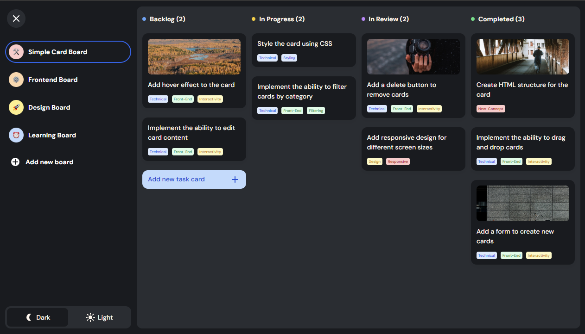

<h1 align="center">Task Manager</h1>

🚀 Key Features

📋 Multiple Boards — users can create and delete boards, each with its own unique logo.

🧠 Local caching with Zustand — all boards and tasks are stored in sessionStorage, no backend needed.

📝 Task creation & editing — interactive forms with validation and sensible default values.

🔖 Tags and Status system — custom FieldSelect and TagItem components with multi-select support.

⚡ Drag & Drop powered by @hello-pangea/dnd — smooth task movement between columns with zero unnecessary re-renders.

🌗 Theme switcher — automatic and manual light/dark mode with local persistence.

💬 Context menu — custom ContextMenu for managing boards with native UX feel.

🧭 Keyboard navigation — full keyboard accessibility and WAI-ARIA compliance for dropdowns and selects.

## Table of Contents

- [Overview](#overview)
- [Built with](#built-with)
- [Contact](#contact)

## Overview

### Built with

- SCSS (BEM)
- TypeScript
- React
- Vite
- Zustand
- FSD
- Eslint, Stylelint, Prettier
- Sonner

## Author

- Website [Task Manager](https://nakhimovv.github.io/task-manager)
- GitHub [NakhimoVV](https://github.com/NakhimoVV)
